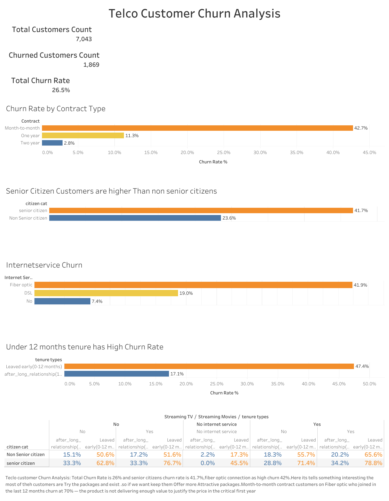

# 📊 Telco Customer Churn Analysis using SQL, Pandas & Tableau



An end-to-end customer churn analysis project using **SQL**, **Python (Pandas)**, and **Tableau**. This project cleans and analyzes telecom customer data, cross-verifies every major finding using both SQL and Pandas, and presents business insights through an interactive Tableau dashboard.

The analysis covers **7,043 telecom customers** and identifies the strongest factors associated with customer churn while providing business-focused recommendations to improve customer retention.

---

# 🚀 Project Links

📓 **Kaggle Notebook**

https://www.kaggle.com/code/satyadata/telco-churn-analysis-using-sql-pandas

📊 **Interactive Tableau Dashboard**

https://public.tableau.com/app/profile/satya.p1432/viz/telco_customer_churn_analysis/Dashboard1#1

---

# 📌 Project Objectives

This project answers the following business questions:

- What is the overall customer churn rate?
- Can SQL and Pandas produce identical analytical results?
- Which contract type has the highest churn rate?
- Does customer tenure influence churn?
- Which internet service has the highest churn rate?
- Do senior citizens churn more frequently?
- Are higher monthly charges associated with higher churn?
- Which customer profile has the highest observed churn risk?
- What percentage of churned customers are on month-to-month contracts?
- Identify the highest-risk customer segment using contract type, internet service, and tenure.

---

# 📈 Key Findings

### Overall Churn Rate

- **27%** of customers churned.

### Contract Type

- Month-to-Month contracts: **43%**
- One-Year contracts: **11%**
- Two-Year contracts: **3%**

### Customer Tenure

- Customers with tenure under 12 months: **47%**
- Customers with tenure above 12 months: **17%**

### Internet Service

- Fiber Optic: **42%**
- DSL: **19%**
- No Internet Service: **7%**

### Senior Citizens

- Senior Customers: **42%**
- Non-Senior Customers: **24%**

### Highest Observed Churn-Risk Segment

Customers with:

- Month-to-Month Contract
- Fiber Optic Internet
- Tenure under 12 months

show a **70.20% churn rate**, making this the highest observed churn-risk segment identified in this analysis.

---

# 💼 Business Recommendations

- Encourage migration from Month-to-Month contracts to longer-term plans.
- Improve customer onboarding during the first year.
- Investigate Fiber Optic customer experience through surveys and root-cause analysis.
- Develop targeted retention strategies for senior customers.
- Monitor customers matching the highest-risk profile for proactive retention efforts.

---

# ✅ Cross Verification

One of the core objectives of this project is to validate analytical accuracy.

Every major business metric is independently calculated using both:

- SQL
- Python (Pandas)

The results are then compared to confirm consistency between both analytical approaches.

---

# 📊 Tableau Dashboard

The interactive Tableau dashboard provides a visual summary of customer churn patterns, including:

- Total Customers
- Churned Customers
- Overall Churn Rate
- Contract Type Analysis
- Internet Service Analysis
- Senior Citizen Analysis
- Customer Tenure Analysis
- Highest-Risk Customer Segment


View Dashboard:

https://public.tableau.com/app/profile/satya.p1432/viz/telco_customer_churn_analysis/Dashboard1#1

---

# 🛠️ Technologies Used

- SQL
- PostgreSQL
- Python
- Pandas
- NumPy
- Matplotlib
- Tableau Public
- Jupyter Notebook

---

# 📂 Repository Structure

```
telco-customer-churn-analysis/
│
├── README.md
├── telco_customer_churn_analysis.ipynb
├── telco_customer_churn.sql
├── requirements.txt
├── LICENSE
└── images/
```

---

# 📊 Dataset

**Dataset:** Telco Customer Churn

- Records: **7,043**
- Source:
  https://www.kaggle.com/datasets/blastchar/telco-customer-churn

> **Note:** The dataset belongs to the original authors and is **not included** in this repository. Please download it from Kaggle before running the notebook.

---

# ▶️ How to Run

### Clone the repository

```bash
git clone https://github.com/satya-data-analyst/telco-customer-churn-analysis.git
```

### Install dependencies

```bash
pip install -r requirements.txt
```

### Download the dataset

Download the dataset from Kaggle and place the CSV file in your working directory.

### Open the notebook

```
telco_customer_churn_analysis.ipynb
```

Run all notebook cells.

---

# ⭐ Project Highlights

- End-to-End Customer Churn Analysis
- SQL Data Cleaning & ETL
- SQL + Pandas Cross Verification
- Business-Oriented Analysis
- Interactive Tableau Dashboard
- Executive Summary
- Actionable Business Recommendations

---

# 👤 Author

**Satya**

Data Analytics Portfolio

### Skills Demonstrated

- SQL
- PostgreSQL
- Python
- Pandas
- Data Cleaning
- Exploratory Data Analysis (EDA)
- Business Analytics
- Data Visualization
- Tableau
